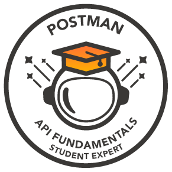

# 💫 About Me:
About Me  Hey! 👋 I'm a software engineer who’s super passionate about Machine Learning and AI 🤖. I love bringing ideas to life through code. Whether it's training ML models, building cool apps, or finding awesome patterns in data 🔍. Always up for a new challenge and excited about how tech can change the world!  My GitHub is my playground 🛠️, where I share some of the projects I’ve been working on. Check it out here and let’s team up to build something awesome together! 🚀

# Postman API Fundamentals Student Expert Badge

**Issued On:** October 24, 2024  
**Badge URL:** [View Badge](https://api.badgr.io/public/assertions/gf-EDurzSmmfaNN0gCqn-Q)  
**Description:** This badge was awarded for demonstrating proficiency with APIs and Postman by completing foundational tasks in Postman and passing all tests with a submitted Postman Collection.

*Verification:* This badge is hosted on Badgr and can be verified at the following link: [Verify Badge](https://api.badgr.io/public/assertions/gf-EDurzSmmfaNN0gCqn-Q)

# Google Cloud Applied AI Summit Attendee Badge

  <!-- Replace this with the actual path to your badge image -->

**Issued On:** February 13, 2024   
**Badge URL:** [View Badge](https://www.credential.net/b5c82bdb-9d9b-42e9-9d4b-b3a953dc8bcc)

**Description:** This badge was awarded to participants who attended 5 or more sessions at the Google Cloud Applied AI Summit. The event featured content for Developers, IT Professionals, and Business Leaders to explore the latest generative AI models, tools, and real-world use cases.

---

*Verification:* This badge can be verified at the following link: [Verify Badge](https://www.credential.net/b5c82bdb-9d9b-42e9-9d4b-b3a953dc8bcc)

---

## 🌐 Socials:
 

# 💻 Tech Stack:
                                  
# 📊 GitHub Stats:
 
 

## 🏆 GitHub Trophies

### ✍️ Random Dev Quote

### 🔝 Top Contributed Repo

---

<!-- Proudly created with GPRM ( https://gprm.itsvg.in ) -->
